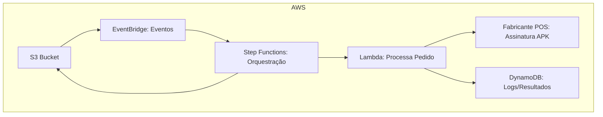
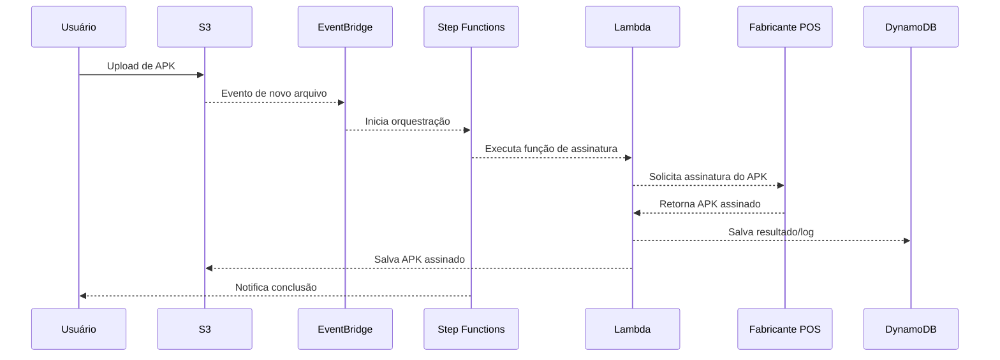

# Arquitetura Atual do demo-signserver

Este documento descreve a arquitetura atual do projeto, incluindo dois diagramas: um de arquitetura AWS e outro de sequência do fluxo principal.

## Diagrama 1: Arquitetura AWS

## Diagrama 2: Sequência do Fluxo

---

> **Observação:** O fluxo inicia após a criação de um arquivo no S3, disparando todo o processo de assinatura e orquestração descrito acima.
